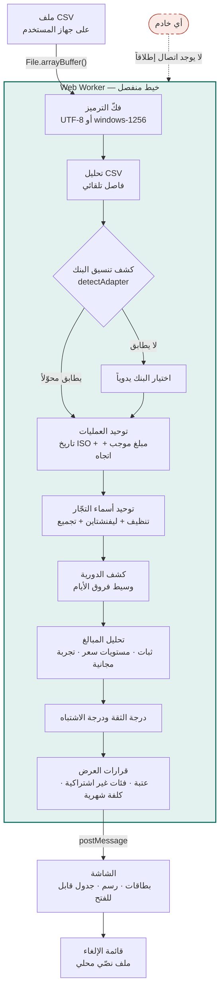

# رصيد (Rasid)

**كاشف الاشتراكات المنسيّة من كشف الحساب البنكي — يعمل داخل متصفحك بالكامل.**

<div align="center">
  
</div>

> **صفر رفع بيانات لأي خادم.** لا حساب مستخدم، ولا تحليلات، ولا طلب شبكة واحد
> بعد فتح الصفحة. أغلق الإنترنت وجرّب — سيعمل كما هو.

```bash
npm install && npm run dev
```

---

## 1. المشكلة

الاشتراكات الشهرية مصمَّمة لتُنسى. تشترك مرة واحدة، فيصير الخصم تلقائياً
وصامتاً وصغيراً بما يكفي لألّا تلحظه عين وهي تمرّ على كشف الحساب. ثلاثة أنماط
تحديداً تكلّف الناس مالاً لا يعرفون أنهم يدفعونه:

- **اشتراك نُسي تماماً** — خدمة لم تُستخدم منذ أشهر والخصم مستمر
- **زيادة سعر صامتة** — 39 ريالاً صارت 56 بلا إشعار يُقرأ
- **تجربة مجانية تحوّلت** — رسم رمزي في الشهر الأول ثم السعر الكامل بعده

كشف الحساب يحوي الجواب كاملاً، لكن قراءته يدوياً تعني مقارنة مئات الصفوف عبر
اثني عشر شهراً، ومطابقة `POS NETFLIX.COM*4423` بـ `NETFLIX.COM AMSTERDAM NL`،
وحساب الفروق بالأيام. لا أحد يفعل ذلك.

---

## 2. الفجوة في الحلول الحالية

| الحل | الفجوة |
| --- | --- |
| تطبيقات تجميع الحسابات (Mint، Rocket Money…) | تطلب **ربط حسابك البنكي** ورفع بياناتك إلى خوادمها — ثمنٌ لا يقبله كثيرون مقابل قائمة اشتراكات |
| جداول Excel اليدوية | تعمل، لكنها تفشل مع الأوصاف الفوضوية والدورات المنزلقة، وتحتاج ساعة عمل شهرياً |
| تنبيهات البنك | تخبرك بالخصم بعد وقوعه، ولا ترى النمط عبر الشهور |
| أدوات "ابحث عن رسوم متكررة" البسيطة | تبحث عن **خصم في نفس اليوم من كل شهر**، فتفوّت كل اشتراك بدورة ثابتة بالأيام |

الفجوة الحقيقية إذن ليست في الخوارزمية بل في **شرط الوصول**: كل ما يعمل يطلب
بياناتك. ورصيد يحلّ هذا بأن يجعل الحساب كلّه داخل جهازك.

أما النقطة الأخيرة في الجدول فهي المشكلة التقنية الأساسية:

```
اشتراك كل 28 يوماً يبدأ في 1 يناير:
1 يناير → 29 يناير → 26 فبراير → 25 مارس → 22 أبريل → 20 مايو
```

ستة خصوم في ستة أيام مختلفة من الشهر، وأحد الشهور فيه خصمان والآخر يبدو
فارغاً. أي منطق يعتمد على رقم اليوم يرى فوضى. رصيد يقيس **فروق الأيام**:
`[28, 28, 28, 28, 28]` — أنظف نمط ممكن.

---

## 3. آلية العمل



القراران اللذان يميّزان المحرك:

1. **القياس بالأيام لا بالتقويم** — وسيط الفروق بين الخصوم هو أساس التصنيف،
   فتُكشف الدورة المنزلقة بنفس قوة الدورة الشهرية المنتظمة.
2. **الوسيط لا المتوسط** — فروق `[30, 30, 30, 30, 180]` (اشتراك انقطع خمسة
   أشهر) متوسطها 60 يوماً وهو تصنيف خاطئ تماماً، ووسيطها 30 وهو الصحيح.

---

## 4. النتائج الفعلية

كل رقم هنا مأخوذ من [`eval/RESULTS.md`](eval/RESULTS.md) المولَّد آلياً بأمر
`npm run eval`، مقيساً على **12 كشف حساب اصطناعياً بحقيقة أرضية معروفة**
(2153 عملية، 6–12 شهراً لكل كشف، موزّعة على تنسيقات البنوك الأربعة). لا رقم
في هذا الملف كُتب يدوياً.

| المقياس | النتيجة |
| --- | --- |
| **recall** | **90.0%** |
| **precision** | **99.1%** |
| F1 | 94.3% |
| دقة تصنيف نوع الدورة | 100.0% (108/108) |
| دقة كشف زيادات الأسعار | 100.0% (12/12) |
| دقة كشف التجارب المتحوّلة | 100.0% (12/12) |
| كشف تنسيق البنك تلقائياً | 100.0% (12/12) |
| زمن المعالجة لكل 1000 عملية | 148 مللي ثانية (وسيط 5 تشغيلات، المدى 114–209) |

### أين يفشل — بصراحة

**كل** الحالات الفائتة الاثنتي عشرة من نوع واحد: **الاشتراك السنوي**.

| نوع الحالة | recall |
| --- | --- |
| اشتراك شهري ثابت | 100.0% |
| اشتراك بدورة 28 يوماً | 100.0% |
| اشتراك ارتفع سعره | 100.0% |
| تجربة مجانية تحوّلت | 100.0% |
| اشتراك أُلغي في المنتصف | 100.0% |
| اشتراك متذبذب بصرف العملة | 100.0% |
| اشتراك فُقد منه شهر | 100.0% |
| **اشتراك سنوي** | **0.0%** |

السبب بنيوي لا برمجي: المحرك يشترط **ثلاثة خصوم على الأقل** قبل أن يتحدّث عن
تكرار (عمليتان تعطيان فارقاً واحداً، والفارق الواحد قد يكون مصادفة). والاشتراك
السنوي في نافذة 6–12 شهراً يظهر مرة أو مرتين فحسب. الحلّ الوحيد كشفُ حساب
يغطّي سنتين، لا تعديلٌ في الخوارزمية.

الخطأ الموجب الوحيد كان متجراً اشتُري منه أربع مرات بمبالغ متقاربة على فترات
شبه منتظمة — حالة يصعب على قارئ بشري أن يجزم فيها أيضاً.

> **قاعدة صارمة في هذا المستودع:** لا يُكتب أي رقم أداء في أي ملف قبل تشغيل
> `npm run eval` فعلياً والحصول على الرقم الحقيقي.

---

## 5. الخصوصية

**صفر شبكة. صفر خادم. صفر تخزين.**

الملف يُقرأ عبر `File.arrayBuffer()` ويُعالَج في الذاكرة داخل Web Worker
ويُعرض. لا يُرفع، ولا يُحفَظ في `localStorage`، ولا يُرسل إلى أي مكان.

### كيف تحقّقنا فعلياً — لا ادّعاءً

بُني المشروع (`npm run build`)، وشُغّل عبر `npm run preview`، وفُتحت الصفحة
مع **تبويب Network مفتوحاً**، ثم رُفع ملف CSV حقيقي. الحصيلة:

| المرحلة | طلبات الشبكة |
| --- | --- |
| تحميل الصفحة | 4 طلبات، **كلها من نفس الأصل**: `/`، حزمة JS، ملف CSS، ملف العامل |
| بعد رفع الملف وتحليله بالكامل | **صفر طلبات إضافية** |
| بعد فتح الصفوف وتصدير قائمة الإلغاء | **صفر طلبات إضافية** |

ولأن المراجعة البشرية تنسى، أُضيفت طبقة يفرضها المتصفح نفسه: **سياسة أمان
محتوى** تُحقن في الصفحة المبنيّة (انظر `vite.config.ts`) وفيها
`connect-src 'none'` التي تقطع `fetch` وXHR وWebSocket نهائياً، و
`default-src 'self'` التي تمنع أي مورد خارجي. لو تسلّل يوماً سطر يستدعي خطاً
أو تحليلات، يمنعه المتصفح ويسجّله في الطرفية بدل أن يمرّ صامتاً.

ولذلك أيضاً: **لا خطوط ويب خارجية**، ولا أيقونات من CDN، ولا مكتبة رسوم
بيانية. الخطوط من النظام، والرسم أعمدة CSS، والتنسيق عبر `Intl` المدمجة.

---

## 6. ما لا يفعله هذا المشروع

قائمة صريحة، لا "قريباً":

- **لا يقرأ ملفات PDF.** كشوف PDF تحتاج استخراج نصّ هشّاً يخطئ بصمت. CSV فقط.
- **لا يربط بحسابك البنكي.** لا Open Banking ولا Plaid ولا بيانات دخول. أنت
  تصدّر الملف بنفسك.
- **ليس تطبيق هاتف.** صفحة ويب واحدة تعمل على متصفح الهاتف بتصميم متجاوب.
- **لا يلغي شيئاً نيابةً عنك.** يعطيك قائمة، والإلغاء يبقى قرارك وفعلك.
- **لا يستخدم ذكاءً اصطناعياً ولا نماذج لغوية** في التصنيف. كل شيء إحصاء
  صريح مكتوب وقابل للقراءة والمراجعة سطراً سطراً.
- **لا حسابات مستخدمين ولا حفظ ولا مزامنة.** أغلق التبويب يذهب كل شيء.
- **لا يعرف إن كنت تستخدم الخدمة.** يرى الأنماط في كشفك فقط.
- **لا يحوّل العملات.** سعر الصرف يحتاج شبكة، والشبكة ممنوعة — فالمجاميع
  مفصولة لكل عملة على حدة.

### حدود معروفة ومكشوفة

- **الإيجار الشهري الثابت** يشبه الاشتراك رياضياً تماماً. نعالجه بقائمة كلمات
  مفتاحية (إيجار، قسط، راتب، تأمين) تُخرجه من المجاميع **مع إبقائه معروضاً**
  بوسم فئته — لأن المستخدم أدرى بإيجاره. القائمة مطابقة نصّية، فهي هشّة:
  إيجار باسم شركة عقارية بحتة لن يُلتقط.
- **البقالة الأسبوعية** تُستبعد تلقائياً باختبار ثبات المبلغ وحده، بلا قاعدة
  خاصة بها.
- **الاشتراك السنوي** لا يُكشف في نافذة أقل من سنتين (انظر القسم 4).

---

## 7. القرارات المعمارية

### لماذا Web Worker

أثقل خطوة هي توحيد أسماء التجّار: مقارنة ليفنشتاين بين كل وصف فريد وقادة
المجموعات القائمة، أي عمل تربيعي في أسوأ الحالات. على كشف كبير يستغرق ذلك مئات
المللي ثانية **متصلة بلا انقطاع** — كافية لتجميد الصفحة تماماً: لا شريط تقدّم
يتحرّك ولا زرّ يستجيب. تقسيم العمل إلى دفعات كان بديلاً، لكنه يفرض تفكيك
`src/core` النقي إلى آلة حالة متقطّعة لخدمة الواجهة. العامل يحقّق الغرض بلا
لمس سطر من المنطق: خيط ثانٍ يعمل بحرّية، وخيط الواجهة حرّ للرسم والاستجابة.

### لماذا Levenshtein محلية مطوّرة من الصفر

البنك يكتب التاجر الواحد بعشرة أشكال، ولا تُكشف الدورية إلا إذا اجتمعت في
مجموعة واحدة. أي مكتبة تشابه نصوص جاهزة كانت ستضيف اعتمادية خارجية إلى مشروع
شرطه الأول ألّا يتصل بشيء. والتطبيق هنا **سطران وثلاثون** بصفّين بدل مصفوفة
كاملة (ذاكرة `O(min(m,n))`) مع قصّ مبكر يوقف الحساب حين تتجاوز المسافة ما
يهمّنا — وهو ما يجعل تجميع آلاف الأوصاف عملياً في المتصفح.

والتجميع بخوارزمية "قائد ومنضمّون" لا بالربط الأحادي: كل شكل يُقارن بقائد كل
مجموعة فقط، فلا يحدث تسلسل (A تشبه B، وB تشبه C) يبتلع تجّاراً متباعدين في
مجموعة واحدة.

### لماذا وسيط لا متوسط

كشف الحساب مليء بالقيم الشاذة: عملية أُجّلت لعطلة، خصم مضاعف بالخطأ، شهر صدرت
فاتورته متأخرة. المتوسط ينجرف خلف قيمة شاذة واحدة، والوسيط يصمد حتى تفسد نصف
القيم:

```
فروق اشتراك شهري انقطع خمسة أشهر ثم عاد: [30, 30, 30, 30, 180]
المتوسط = 60 يوماً  →  "ربع سنوي تقريباً"  ✗ خطأ
الوسيط  = 30 يوماً  →  "شهري"              ✓ صحيح
```

ولذلك أيضاً مقياس التشتت هنا هو **متوسط الانحراف المطلق حول الوسيط** لا
الانحراف المعياري ولا MAD الكلاسيكي: مركزه وسيط فلا تجرّه قيمة شاذة، لكنه يجمع
كل الانحرافات فتبقى القيمة الشاذة **مرئية**. الوسيط يقول "شهري"، ودرجة
الانتظام تقول "لكن ثق بها قليلاً" — وهذا الفصل مقصود.

### لماذا لا عتبة في المحرك

`detectionEngine.ts` لا يقرّر ما هو اشتراك: يخرج كل مجموعة بدرجتيها (ثقة
واشتباه) ويترك القطع لـ `decision.ts`، الذي عُويرت عتبته (**0.60**) من مسح
عتبات كامل في `eval/RESULTS.md` — لا من الحدس. المسح يُظهر هضبة مستقرة بين
0.55 و0.65، والعتبة منتصفها.

---

## 8. التشغيل محلياً

```bash
npm install
```

```bash
npm run dev
```

ثم افتح `http://localhost:5173` — أو اضغط **"جرّب ببيانات تجريبية"** فيولّد
التطبيق كشف حساب داخل متصفحك ويمرّره على نفس خط التحليل، بلا أي ملف حقيقي.

| الأمر | ماذا يفعل |
| --- | --- |
| `npm run dev` | خادم التطوير |
| `npm run test` | 440 اختباراً |
| `npm run build` | فحص الأنواع + بناء الإنتاج |
| `npm run preview` | تشغيل الملف المبنيّ محلياً |
| `npm run eval` | التقييم الكمّي ← يعيد توليد `eval/RESULTS.md` |

### النشر

لا يحتاج النشر أي إعداد في الكود: `base: './'` في `vite.config.ts` يجعل
المسارات نسبية فيعمل الموقع من مسار المستودع الفرعي. يبقى تفعيله مرة واحدة
في المستودع:

1. ادفع المشروع إلى GitHub.
2. من **Settings ← Pages**، اختر **GitHub Actions** مصدراً للنشر.

بعدها يتكفّل [`deploy.yml`](.github/workflows/deploy.yml) بالباقي: ينشر بعد
**نجاح** CI على `main` فقط، فلا يصل إلى الويب بناءٌ لم تنجح اختباراته. يظهر
الرابط في تبويب Actions وفي Settings ← Pages.

---

## 9. بنية المستودع

| المجلد | المحتوى |
| --- | --- |
| `src/core/` | كل المنطق — دوال نقية بلا React وبلا متصفح |
| `src/adapters/` | تنسيقات البنوك، ملف لكل بنك |
| `src/ui/` | الواجهة والعامل، وكل النصوص في `i18n.ts` |
| `eval/` | مولّد البيانات وسكربت القياس والنتائج |
| `tests/` | 440 اختبار vitest |
| `docs/` | [`WALKTHROUGH.md`](docs/WALKTHROUGH.md) — شرح كل ملف في المستودع |

**شرح المشروع ملفاً بملف في [`docs/WALKTHROUGH.md`](docs/WALKTHROUGH.md).**

### إضافة بنك جديد

ملف واحد جديد في `src/adapters/`، بلا تعديل أي كود قائم — يلتقطه
`import.meta.glob` تلقائياً:

```ts
import { createBankAdapter } from './createBankAdapter';

export default createBankAdapter({
  id: 'my-bank',
  label: 'اسم البنك',
  dateFormat: 'DD/MM/YYYY',
  defaultCurrency: 'SAR',
  columns: {
    date: ['التاريخ', 'Date'],
    description: ['البيان', 'Description'],
    currency: ['العملة'],
  },
  amount: { kind: 'split', debit: ['مدين'], credit: ['دائن'] },
});
```

المحوّلات الحالية: `alrajhi`، `snb`، `chase`، `enbd`.

---

## 10. الترخيص والبيانات

لا يحتوي هذا المستودع — ولا تاريخ الـ commits فيه — أي كشف حساب حقيقي. كل
البيانات المستخدمة في الاختبارات والتقييم والعرض التجريبي **مولَّدة برمجياً**
في `src/core/synthetic.ts` ببذرة رقمية ثابتة. و`.gitignore` يمنع صراحةً
`*.statement.csv` ومجلّد `private/` احتياطاً.
